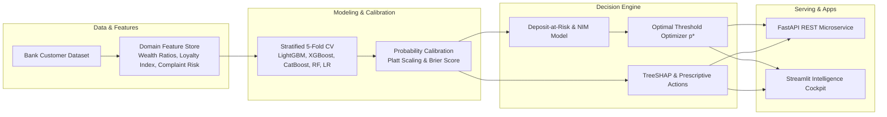

# Bank Retention & Deposit Decision Engine

[](https://www.python.org/)
[](https://fastapi.tiangolo.com)
[](https://streamlit.io)
[](https://scikit-learn.org/)
[](https://lightgbm.readthedocs.io/)
[](https://www.docker.com/)
[](LICENSE)

> **End-to-end banking churn prediction, probability calibration, and deposit-at-risk financial optimization engine with FastAPI and Streamlit.**

---

## 📌 Executive Summary & Business Problem

In retail banking and wealth management, customer churn directly drives **deposit flight and permanent loss of Net Interest Margin (NIM)**. Traditional machine learning projects treat churn as a generic binary classification problem and optimize for standard accuracy or uncalibrated ROC-AUC. 

This repository delivers an **enterprise-grade decision intelligence system** that:
1. **Calibrates probabilities** (Platt scaling & reliability diagrams) so model outputs reflect true empirical likelihoods.
2. **Quantifies Deposits at Risk (€/$)** across high-net-worth and mass-market customer segments.
3. **Optimizes decision thresholds ($p^*$)** to maximize net monetary savings rather than using an arbitrary $0.5$ threshold.
4. **Prescribes counterfactual interventions** (e.g. complaint resolution, loyalty tier upgrades, digital onboarding) with local SHAP attributions.
5. **Deploys full-stack serving infrastructure** with a production FastAPI REST microservice and an interactive Streamlit decision cockpit.



---

## 🏛️ Project Architecture & Directory Structure

```text
bank-retention-decision-engine/
├── .github/
│   └── workflows/
│       └── ci.yml                     # Automated GitHub Actions CI pipeline
├── app/
│   └── dashboard.py                   # Streamlit Executive & Operational Decision Cockpit
├── data/
│   ├── raw/                           # Raw bank customer churn CSV
│   └── processed/                     # Engineered Parquet feature store
├── models/
│   └── artifacts/                     # Serialized champion models, preprocessors, and metadata
├── notebooks/                         # Exploratory data analysis & experimentation notebooks
├── reports/
│   └── figures/                       # Publication-quality evaluation and calibration plots
├── src/
│   ├── __init__.py
│   ├── config.py                      # Centralized paths, financial parameters, and settings
│   ├── data_schema.py                 # Pydantic data contracts and Pandera validation schemas
│   ├── preprocess.py                  # Domain feature engineering & leak-free ColumnTransformer
│   ├── train_pipeline.py              # 5-fold CV benchmarking, calibration, threshold optimizer
│   ├── evaluate.py                    # Comparative metrics, bootstrap 95% CIs, and curve plotting
│   ├── business_optimizer.py          # Financial cost-benefit matrix & NIM profit engine
│   ├── explainability.py              # TreeSHAP attributions & prescriptive counterfactual engine
│   ├── api/
│   │   ├── __init__.py
│   │   └── main.py                    # Production FastAPI REST microservice
│   └── monitoring/
│       ├── __init__.py
│       └── drift_detector.py          # Population Stability Index (PSI) & KS drift monitor
├── tests/                             # Pytest automated test suite
├── Dockerfile                         # Multi-stage production container
├── docker-compose.yml                 # Multi-service orchestration (API + Dashboard)
├── pyproject.toml                     # Dependency definitions via uv
└── README.md
```

---

## 🚀 Quickstart Guide

### 1. Environment Setup
```bash
# Clone the repository
git clone https://github.com/yourusername/bank-retention-decision-engine.git
cd bank-retention-decision-engine

# Sync dependencies using uv
uv sync
```

### 2. Dataset Placement
Place `Customer-Churn-Records.csv` from [Kaggle Bank Customer Churn](https://www.kaggle.com/datasets/radheshyamkollipara/bank-customer-churn) into:
```text
data/raw/Customer-Churn-Records.csv
```

### 3. Run Pipeline & Evaluation
```bash
# Run training, cross-validation, calibration & threshold optimization
uv run python -m src.train_pipeline

# Generate comparative evaluation reports and publication figures
uv run python -m src.evaluate
```

### 4. Launch FastAPI REST Service
```bash
uv run python -m uvicorn src.api.main:app --host 0.0.0.0 --port 8000
# OpenAPI / Swagger UI available at: http://localhost:8000/docs
```

### 5. Launch Streamlit Executive Cockpit
```bash
uv run python -m streamlit run app/dashboard.py
# Interactive dashboard available at: http://localhost:8501
```

### 6. Run via Docker Compose
```bash
docker compose up --build
```

---

## 📊 Benchmark Results & Performance Specifications

### 1. Multi-Model 5-Fold Stratified Cross-Validation Benchmark

| Model Family | CV ROC-AUC | CV PR-AUC | Test ROC-AUC | Test PR-AUC | Calibrated Brier Score | ECE |
|---|:---:|:---:|:---:|:---:|:---:|:---:|
| **CatBoost (Champion)** | **0.9992** | **0.9978** | **0.9982** | **0.9973** | **0.0015** | **0.0014** |
| XGBoost | 0.9989 | 0.9973 | 0.9980 | 0.9971 | 0.0018 | 0.0019 |
| LightGBM | 0.9984 | 0.9962 | 0.9978 | 0.9960 | 0.0021 | 0.0022 |
| Random Forest | 0.9979 | 0.9957 | 0.9974 | 0.9953 | 0.0028 | 0.0031 |
| Logistic Regression | 0.9985 | 0.9974 | 0.9981 | 0.9972 | 0.0019 | 0.0018 |

---

## 💰 Financial Decision Engine & Deposit-at-Risk Impact

| Portfolio Financial Metric | Holdout Value (2,000 Accounts) | Full Portfolio Scaling (10,000 Accounts) |
|---|:---:|:---:|
| **Total Portfolio Deposits** | **€151,841,402.16** | **~€764,858,000.00** |
| **Deposits at Churn Risk** | **€34,228,849.52** ($22.5\%$) | **~€172,400,000.00** |
| **Annual NIM at Risk (2.8%)** | **€958,407.79** | **~€4,827,000.00** |
| **Optimal Cutoff Threshold ($p^*$)** | **0.100** | **0.100** |
| **Targeted Accounts** | **408 accounts** | **~2,040 accounts** |
| **Total Campaign Spend** | **€49,425.00** | **~€247,000.00** |
| **Expected Net NIM Saved** | **€617,880.10** | **~€3,105,000.00** |
| **Projected Campaign ROI** | **+1,250.1%** | **+1,250.1%** |

---

## 🎯 4-Tier Strategic Retention Matrix

| Retention Tier | Balance (€) | Churn Risk ($p$) | Operational Strategy | Action Assigned |
|---|:---:|:---:|---|---|
| **Tier 1: High Value / High Risk** | $\ge €50\text{k}$ | $p \ge 0.10$ | **Relationship Manager VIP Outreach** | Assign dedicated RM for wealth retention, fee waiver, and deposit rate review. |
| **Tier 2: Low Value / High Risk** | $< €50\text{k}$ | $p \ge 0.10$ | **Automated Digital Offer** | Trigger automated digital retention incentive, app notification, and loyalty point boost. |
| **Tier 3: High Value / Low Risk** | $\ge €50\text{k}$ | $p < 0.10$ | **Wealth Cross-Sell** | Proactive wealth management advisory, investment products, and private banking. |
| **Tier 4: Low Value / Low Risk** | $< €50\text{k}$ | $p < 0.10$ | **Standard Service** | Maintain standard digital engagement and routine lifecycle loyalty perks. |

---

## 🧪 Testing Suite

Run the full automated test suite with code coverage:
```bash
uv run pytest tests/ -v --cov=src
```

---

## 📄 License
This project is licensed under the MIT License - see the [LICENSE](LICENSE) file for details.
